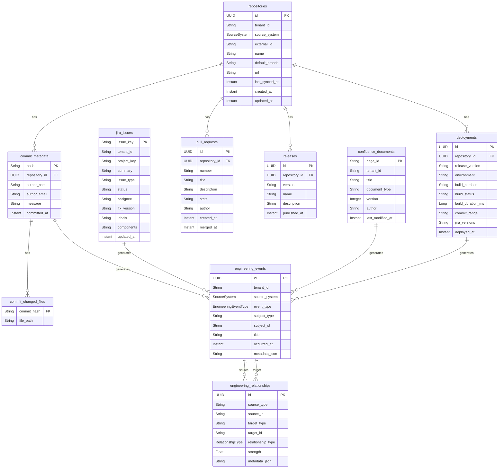
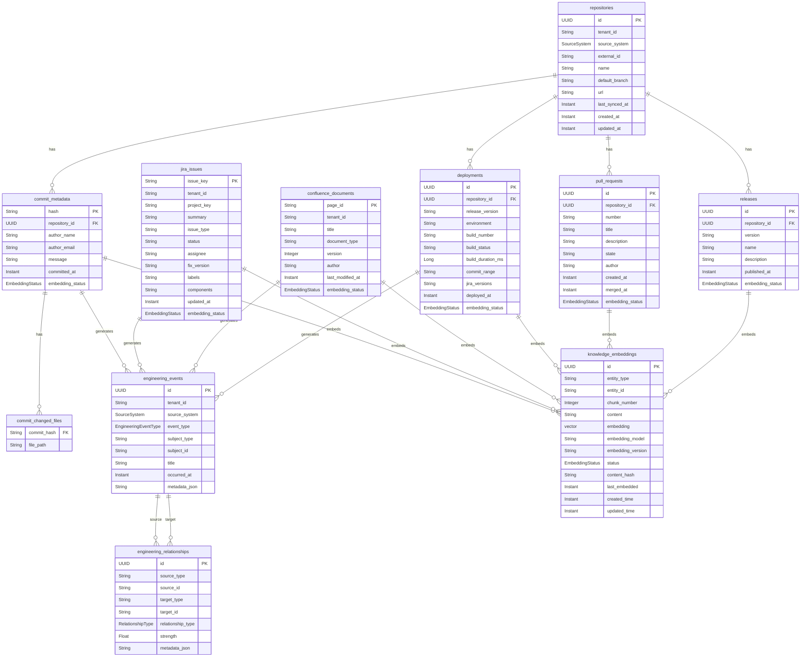

# SentinelAI Knowledge Service V2 - Database Diagrams

## 1. Current Database Schema

### Existing Tables (V1)



## 2. New Database Schema (V2)

### Enhanced Schema with Embedding Support



## 3. Knowledge Embeddings Table Details

### Table Structure

```sql
CREATE TABLE knowledge_embeddings (
    -- Primary Key
    id UUID PRIMARY KEY DEFAULT gen_random_uuid(),
    
    -- Entity Reference
    entity_type VARCHAR(80) NOT NULL,
    entity_id VARCHAR(256) NOT NULL,
    chunk_number INTEGER NOT NULL DEFAULT 0,
    
    -- Content
    content TEXT NOT NULL,
    
    -- Vector Embedding
    embedding vector(1536),
    
    -- Embedding Metadata
    embedding_model VARCHAR(120) NOT NULL,
    embedding_version VARCHAR(40) NOT NULL DEFAULT 'v1',
    
    -- Status
    status VARCHAR(40) NOT NULL DEFAULT 'PENDING',
    
    -- Hash for deduplication
    content_hash VARCHAR(64),
    
    -- Timestamps
    last_embedded TIMESTAMP WITH TIME ZONE,
    created_time TIMESTAMP WITH TIME ZONE NOT NULL DEFAULT NOW(),
    updated_time TIMESTAMP WITH TIME ZONE NOT NULL DEFAULT NOW(),
    
    -- Constraints
    CONSTRAINT uk_embedding_entity UNIQUE (entity_type, entity_id, chunk_number),
    CONSTRAINT chk_embedding_status CHECK (status IN ('PENDING', 'PROCESSING', 'COMPLETED', 'FAILED', 'SKIPPED')),
    CONSTRAINT chk_entity_type CHECK (entity_type IN (
        'GITHUB_COMMIT', 
        'GITHUB_PULL_REQUEST', 
        'GITHUB_RELEASE',
        'JIRA_ISSUE',
        'CONFLUENCE_DOCUMENT',
        'JENKINS_DEPLOYMENT'
    ))
);

-- Indexes for vector similarity search
CREATE INDEX idx_embedding_vector_ivfflat ON knowledge_embeddings 
USING ivfflat (embedding vector_cosine_ops) 
WITH (lists = 100);

CREATE INDEX idx_embedding_vector_hnsw ON knowledge_embeddings 
USING hnsw (embedding vector_cosine_ops) 
WITH (m = 16, ef_construction = 64);

-- Indexes for metadata filtering
CREATE INDEX idx_embedding_entity_type ON knowledge_embeddings(entity_type);
CREATE INDEX idx_embedding_status ON knowledge_embeddings(status);
CREATE INDEX idx_embedding_content_hash ON knowledge_embeddings(content_hash);
CREATE INDEX idx_embedding_entity ON knowledge_embeddings(entity_type, entity_id);

-- Index for timestamp queries
CREATE INDEX idx_embedding_last_embedded ON knowledge_embeddings(last_embedded);

-- Trigger for automatic updated_time
CREATE TRIGGER update_knowledge_embedding_time
BEFORE UPDATE ON knowledge_embeddings
FOR EACH ROW
EXECUTE FUNCTION update_updated_time_column();

-- Comment for documentation
COMMENT ON TABLE knowledge_embeddings IS 'Stores vector embeddings for engineering entities to enable semantic search';
COMMENT ON COLUMN knowledge_embeddings.embedding IS 'Vector embedding (1536 dimensions for text-embedding-3-small)';
COMMENT ON COLUMN knowledge_embeddings.content_hash IS 'SHA-256 hash of content for deduplication';
COMMENT ON COLUMN knowledge_embeddings.chunk_number IS 'Chunk number for large documents (0 for unchunked)';
```

## 4. Enhanced Existing Tables

### Commit Metadata Table Enhancement

```sql
ALTER TABLE commit_metadata 
ADD COLUMN embedding_status VARCHAR(40) DEFAULT NULL;

CREATE INDEX idx_commit_embedding_status ON commit_metadata(embedding_status);

COMMENT ON COLUMN commit_metadata.embedding_status IS 'Status of embedding generation: PENDING, PROCESSING, COMPLETED, FAILED';
```

### Jira Issues Table Enhancement

```sql
ALTER TABLE jira_issues 
ADD COLUMN embedding_status VARCHAR(40) DEFAULT NULL;

CREATE INDEX idx_jira_embedding_status ON jira_issues(embedding_status);

COMMENT ON COLUMN jira_issues.embedding_status IS 'Status of embedding generation: PENDING, PROCESSING, COMPLETED, FAILED';
```

### Confluence Documents Table Enhancement

```sql
ALTER TABLE confluence_documents 
ADD COLUMN embedding_status VARCHAR(40) DEFAULT NULL;

CREATE INDEX idx_confluence_embedding_status ON confluence_documents(embedding_status);

COMMENT ON COLUMN confluence_documents.embedding_status IS 'Status of embedding generation: PENDING, PROCESSING, COMPLETED, FAILED';
```

### Deployments Table Enhancement

```sql
ALTER TABLE deployments 
ADD COLUMN embedding_status VARCHAR(40) DEFAULT NULL;

CREATE INDEX idx_deployment_embedding_status ON deployments(embedding_status);

COMMENT ON COLUMN deployments.embedding_status IS 'Status of embedding generation: PENDING, PROCESSING, COMPLETED, FAILED';
```

### Pull Requests Table Enhancement

```sql
ALTER TABLE pull_requests 
ADD COLUMN embedding_status VARCHAR(40) DEFAULT NULL;

CREATE INDEX idx_pr_embedding_status ON pull_requests(embedding_status);

COMMENT ON COLUMN pull_requests.embedding_status IS 'Status of embedding generation: PENDING, PROCESSING, COMPLETED, FAILED';
```

### Releases Table Enhancement

```sql
ALTER TABLE releases 
ADD COLUMN embedding_status VARCHAR(40) DEFAULT NULL;

CREATE INDEX idx_release_embedding_status ON releases(embedding_status);

COMMENT ON COLUMN releases.embedding_status IS 'Status of embedding generation: PENDING, PROCESSING, COMPLETED, FAILED';
```

## 5. Entity Type Mapping

### Entity Type to Table Mapping

| Entity Type | Source Table | Entity ID Field | Content Fields for Embedding |
|-------------|-------------|-----------------|----------------------------|
| GITHUB_COMMIT | commit_metadata | hash | message |
| GITHUB_PULL_REQUEST | pull_requests | id | title, description |
| GITHUB_RELEASE | releases | id | name, description |
| JIRA_ISSUE | jira_issues | issue_key | summary, description, comments |
| CONFLUENCE_DOCUMENT | confluence_documents | page_id | title, body (separate table) |
| JENKINS_DEPLOYMENT | deployments | id | release_version, build_status |

## 6. Embedding Status Lifecycle

### Status Transitions

```
NULL (new entity)
    ↓
PENDING (triggered)
    ↓
PROCESSING (in progress)
    ↓
COMPLETED (success)
    ↓
[STABLE]

OR

PENDING (triggered)
    ↓
PROCESSING (in progress)
    ↓
FAILED (error)
    ↓
PENDING (retry)
    ↓
[...loop until max attempts...]
    ↓
PERMANENTLY_FAILED (give up)
```

### Status Enum Definition

```sql
CREATE TYPE embedding_status AS ENUM (
    'PENDING',
    'PROCESSING', 
    'COMPLETED',
    'FAILED',
    'SKIPPED'
);
```

## 7. Vector Index Configuration

### IVFFlat Index (Recommended for < 1M rows)

```sql
CREATE INDEX idx_embedding_vector_ivfflat ON knowledge_embeddings 
USING ivfflat (embedding vector_cosine_ops) 
WITH (lists = 100);

-- lists = sqrt(number_of_rows)
-- For 10,000 rows: lists = 100
-- For 100,000 rows: lists = 316
-- For 1,000,000 rows: lists = 1000
```

### HNSW Index (Recommended for > 1M rows)

```sql
CREATE INDEX idx_embedding_vector_hnsw ON knowledge_embeddings 
USING hnsw (embedding vector_cosine_ops) 
WITH (m = 16, ef_construction = 64);

-- m = number of connections per node (default: 16)
-- ef_construction = size of dynamic candidate list (default: 64)
-- Higher values = better accuracy, slower build time
```

### Index Selection Guidelines

| Dataset Size | Recommended Index | Build Time | Query Time | Memory Usage |
|-------------|------------------|------------|------------|--------------|
| < 10K rows | IVFFlat (lists=32) | Fast | Fast | Low |
| 10K-100K rows | IVFFlat (lists=100) | Medium | Fast | Low |
| 100K-1M rows | IVFFlat (lists=316) | Slow | Fast | Medium |
| > 1M rows | HNSW (m=16, ef=64) | Very Slow | Very Fast | High |

## 8. Query Patterns

### Vector Similarity Search

```sql
-- Find similar embeddings using cosine similarity
SELECT 
    id,
    entity_type,
    entity_id,
    content,
    1 - (embedding <=> '[0.1,0.2,0.3,...]') as similarity
FROM knowledge_embeddings
WHERE status = 'COMPLETED'
  AND embedding IS NOT NULL
ORDER BY embedding <=> '[0.1,0.2,0.3,...]'
LIMIT 10;
```

### Hybrid Search (Vector + Filters)

```sql
-- Find similar embeddings with entity type filter
SELECT 
    id,
    entity_type,
    entity_id,
    content,
    1 - (embedding <=> '[0.1,0.2,0.3,...]') as similarity
FROM knowledge_embeddings
WHERE status = 'COMPLETED'
  AND embedding IS NOT NULL
  AND entity_type = 'JIRA_ISSUE'
ORDER BY embedding <=> '[0.1,0.2,0.3,...]'
LIMIT 10;
```

### Failed Embeddings Query

```sql
-- Find failed embeddings for retry
SELECT 
    entity_type,
    entity_id,
    chunk_number,
    status,
    last_embedded
FROM knowledge_embeddings
WHERE status = 'FAILED'
  AND last_embedded < NOW() - INTERVAL '1 hour'
ORDER BY last_embedded ASC
LIMIT 100;
```

### Pending Embeddings Query

```sql
-- Find pending embeddings for processing
SELECT 
    entity_type,
    entity_id,
    chunk_number,
    created_time
FROM knowledge_embeddings
WHERE status = 'PENDING'
ORDER BY created_time ASC
LIMIT 100;
```

### Content Deduplication Check

```sql
-- Check if content already exists (by hash)
SELECT 
    id,
    entity_type,
    entity_id,
    status
FROM knowledge_embeddings
WHERE content_hash = 'sha256_hash_here'
LIMIT 1;
```

## 9. Database Migration Strategy

### Phase 1: Add New Table

```sql
-- Migration 001: Create knowledge_embeddings table
CREATE TYPE embedding_status AS ENUM (
    'PENDING',
    'PROCESSING', 
    'COMPLETED',
    'FAILED',
    'SKIPPED'
);

CREATE TABLE knowledge_embeddings (
    id UUID PRIMARY KEY DEFAULT gen_random_uuid(),
    entity_type VARCHAR(80) NOT NULL,
    entity_id VARCHAR(256) NOT NULL,
    chunk_number INTEGER NOT NULL DEFAULT 0,
    content TEXT NOT NULL,
    embedding vector(1536),
    embedding_model VARCHAR(120) NOT NULL,
    embedding_version VARCHAR(40) NOT NULL DEFAULT 'v1',
    status embedding_status NOT NULL DEFAULT 'PENDING',
    content_hash VARCHAR(64),
    last_embedded TIMESTAMP WITH TIME ZONE,
    created_time TIMESTAMP WITH TIME ZONE NOT NULL DEFAULT NOW(),
    updated_time TIMESTAMP WITH TIME ZONE NOT NULL DEFAULT NOW(),
    CONSTRAINT uk_embedding_entity UNIQUE (entity_type, entity_id, chunk_number)
);

CREATE INDEX idx_embedding_vector_ivfflat ON knowledge_embeddings 
USING ivfflat (embedding vector_cosine_ops) 
WITH (lists = 100);

CREATE INDEX idx_embedding_entity_type ON knowledge_embeddings(entity_type);
CREATE INDEX idx_embedding_status ON knowledge_embeddings(status);
CREATE INDEX idx_embedding_content_hash ON knowledge_embeddings(content_hash);
```

### Phase 2: Add Status Columns

```sql
-- Migration 002: Add embedding_status to existing tables
ALTER TABLE commit_metadata 
ADD COLUMN embedding_status embedding_status DEFAULT NULL;

ALTER TABLE jira_issues 
ADD COLUMN embedding_status embedding_status DEFAULT NULL;

ALTER TABLE confluence_documents 
ADD COLUMN embedding_status embedding_status DEFAULT NULL;

ALTER TABLE deployments 
ADD COLUMN embedding_status embedding_status DEFAULT NULL;

ALTER TABLE pull_requests 
ADD COLUMN embedding_status embedding_status DEFAULT NULL;

ALTER TABLE releases 
ADD COLUMN embedding_status embedding_status DEFAULT NULL;
```

### Phase 3: Create Indexes

```sql
-- Migration 003: Create indexes for status columns
CREATE INDEX idx_commit_embedding_status ON commit_metadata(embedding_status);
CREATE INDEX idx_jira_embedding_status ON jira_issues(embedding_status);
CREATE INDEX idx_confluence_embedding_status ON confluence_documents(embedding_status);
CREATE INDEX idx_deployment_embedding_status ON deployments(embedding_status);
CREATE INDEX idx_pr_embedding_status ON pull_requests(embedding_status);
CREATE INDEX idx_release_embedding_status ON releases(embedding_status);
```

### Phase 4: Backfill Data

```sql
-- Migration 004: Backfill existing data with PENDING status
UPDATE commit_metadata SET embedding_status = 'PENDING' WHERE embedding_status IS NULL;
UPDATE jira_issues SET embedding_status = 'PENDING' WHERE embedding_status IS NULL;
UPDATE confluence_documents SET embedding_status = 'PENDING' WHERE embedding_status IS NULL;
UPDATE deployments SET embedding_status = 'PENDING' WHERE embedding_status IS NULL;
UPDATE pull_requests SET embedding_status = 'PENDING' WHERE embedding_status IS NULL;
UPDATE releases SET embedding_status = 'PENDING' WHERE embedding_status IS NULL;
```

## 10. Performance Considerations

### Connection Pool Configuration

```yaml
spring:
  datasource:
    hikari:
      maximum-pool-size: 20
      minimum-idle: 5
      connection-timeout: 30000
      idle-timeout: 600000
      max-lifetime: 1800000
```

### Query Optimization Tips

1. **Always filter by status**: `WHERE status = 'COMPLETED'`
2. **Use appropriate index**: Choose IVFFlat vs HNSW based on dataset size
3. **Limit result sets**: Always use `LIMIT` for vector searches
4. **Batch operations**: Process embeddings in batches of 10-100
5. **Monitor index size**: Rebuild indexes if they become fragmented

### Maintenance Operations

```sql
-- Reindex fragmented indexes
REINDEX INDEX idx_embedding_vector_ivfflat;

-- Update table statistics
ANALYZE knowledge_embeddings;

-- Vacuum old rows
VACUUM knowledge_embeddings;

-- Clean up old failed embeddings
DELETE FROM knowledge_embeddings 
WHERE status = 'FAILED' 
  AND last_embedded < NOW() - INTERVAL '30 days';
```

## 11. Security Considerations

### Row-Level Security (Optional)

```sql
-- Enable RLS on knowledge_embeddings
ALTER TABLE knowledge_embeddings ENABLE ROW LEVEL SECURITY;

-- Create policy for tenant isolation
CREATE POLICY tenant_isolation ON knowledge_embeddings
    FOR ALL
    USING (
        entity_id IN (
            SELECT hash FROM commit_metadata WHERE tenant_id = current_setting('app.current_tenant')
            UNION
            SELECT issue_key::varchar FROM jira_issues WHERE tenant_id = current_setting('app.current_tenant')
            UNION
            SELECT page_id FROM confluence_documents WHERE tenant_id = current_setting('app.current_tenant')
        )
    );
```

### Encryption at Rest

- Use PostgreSQL transparent data encryption (TDE)
- Encrypt sensitive fields like API keys in configuration
- Use SSL for database connections

## 12. Backup and Recovery

### Backup Strategy

```bash
# Full backup
pg_dump -Fc sentinelai_knowledge > knowledge_backup.dump

# Schema-only backup
pg_dump -s sentinelai_knowledge > knowledge_schema.dump

# Table-specific backup
pg_dump -t knowledge_embeddings sentinelai_knowledge > embeddings_backup.dump
```

### Recovery Strategy

```bash
# Restore from backup
pg_restore -d sentinelai_knowledge knowledge_backup.dump

# Restore specific table
pg_restore -t knowledge_embeddings -d sentinelai_knowledge embeddings_backup.dump
```

## 13. Monitoring Queries

### Health Check Queries

```sql
-- Check embedding generation backlog
SELECT 
    status,
    COUNT(*) as count
FROM knowledge_embeddings
GROUP BY status;

-- Check embedding generation rate
SELECT 
    DATE(last_embedded) as date,
    COUNT(*) as embeddings_generated
FROM knowledge_embeddings
WHERE last_embedded > NOW() - INTERVAL '7 days'
GROUP BY DATE(last_embedded)
ORDER BY date DESC;

-- Check index health
SELECT 
    schemaname,
    tablename,
    indexname,
    idx_scan as index_scans,
    idx_tup_read as tuples_read,
    idx_tup_fetch as tuples_fetched
FROM pg_stat_user_indexes
WHERE tablename = 'knowledge_embeddings';

-- Check table size
SELECT 
    pg_size_pretty(pg_total_relation_size('knowledge_embeddings')) as total_size,
    pg_size_pretty(pg_relation_size('knowledge_embeddings')) as table_size,
    pg_size_pretty(pg_total_relation_size('knowledge_embeddings') - pg_relation_size('knowledge_embeddings')) as indexes_size;
```

This database design provides a solid foundation for the Knowledge Service V2 while maintaining backward compatibility with existing tables and structure.